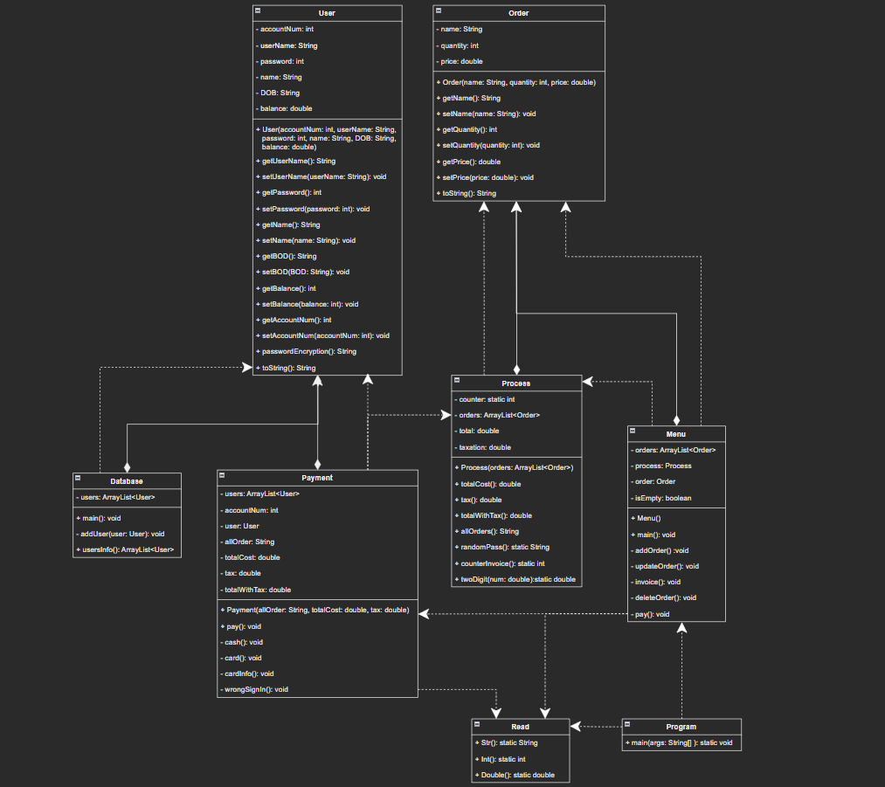

<h1 alian="center">Cash Register</h1> 

cash register is program for management of sales and orders
* add order
* update order
* show invoice
* delete order
* pay
* exit

* ### **add order**
    * when chose to add an order will enter name, quantity and price for one piece order, and can't do anything before adding the order such as update order..

 

* ### **update order**
    * if chose this option you will enter the ID order and then can update the name, quantity and price for this ID

 

* ### **show invoice**
    * you can show orders with the total cost, tax and total cost with tax

 

* ### **delete order**
    * delete order from your orders when enter the ID for this order

 

* ### **pay**
    * after add all orders can pay from this option, you have two ways to pay by cash or card

 

* ### **exit**
    * if choose this option you will exit from the program

 

**Developed by Java and using OOP and data structure...**

* **class diagram**

**Enjoy when testing the program 😎**

**Don't forget to click the star ⭐**